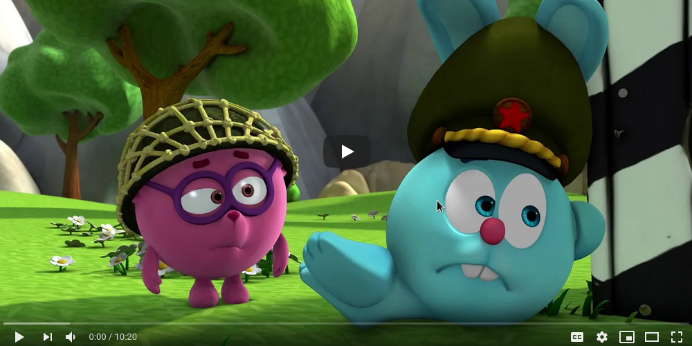

# moviespectrum

A command line tool to generate the color spectrum for a given input video file.
| Source video | Result |
|--------------|--------|
|  | 

## Usage

Build:
```go build cmd/moviespectrum.go```

Prepare a video file, e.g. download it from youtube:
```
youtube-dl --format 160 https://www.youtube.com/watch?v=3-HiGBJ7nJ0
```

Run the tool:
```
./moviespectrum 'KikoRiki Ep. 6 - Season 3 - The Border-3-HiGBJ7nJ0.mp4'
```

The resulting spectrum image file is saved to the file with the same file name as the source video with additional 
".png" extension.

## How it works

1. Get all video pixels
2. Convert pixel to RGB
3. Convert pixel to HSL
4. Spectrum X axis is pixel's Hue
5. Color weight = Saturation * Median lightness difference
6. Median lightness difference = chi square for the pixel's lightness and lightness range middle 
