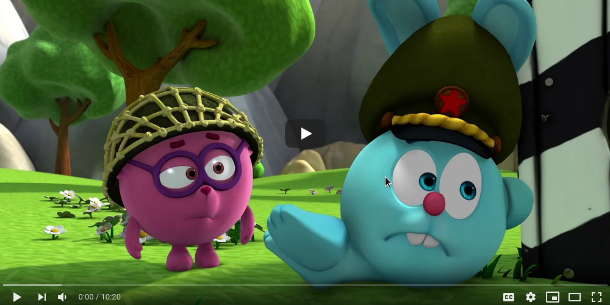

# moviespectrum

A command line tool to generate the color spectrum for a given input video file.
| Source video | Result Spectrum |
|--------------|-----------------|
|  | 

## Usage

Build:
```
go build cmd/moviespectrum.go
```

Prepare a video file, e.g. download it from youtube:
```
youtube-dl --format 160 https://www.youtube.com/watch?v=3-HiGBJ7nJ0
```

Run the tool:
```
./moviespectrum 'KikoRiki Ep. 6 - Season 3 - The Border-3-HiGBJ7nJ0.mp4'
```

The resulting spectrum image file is saved to the file with the same file name as the source video with additional 
".png" extension.

## How it works

1. Convert the source video to 256x144 RGB frames
2. Convert each pixel to HSL
3. Spectrum X axis is pixel's Hue
4. Color weight = Saturation * Median lightness difference
5. Median lightness difference = chi square for the pixel's lightness and lightness range middle 

## Most popular movies

| Year | Source Video Link | Result Spectrum |
|------|-------------------|-----------------|
| 1975 | [Jaws - Theatrical Trailer (HD) (1975)](https://www.youtube.com/watch?v=4pxkU9GVAoA) |  |
| 1977 | [Star Wars A New Hope 1977 Trailer](https://www.youtube.com/watch?v=1g3_CFmnU7k) |  |
| 1985 | [Back To The Future (1985) Theatrical Trailer - Michael J. Fox Movie HD](https://www.youtube.com/watch?v=qvsgGtivCgs) |  |
| 1991 | [Terminator 2: Judgment Day (1991) Trailer #1 Movieclips Classic Trailers](https://www.youtube.com/watch?v=CRRlbK5w8AE) |  |
| 1993 | [Jurassic Park Trailer](https://www.youtube.com/watch?v=lc0UehYemQA) |  |
| 1994 | [Pulp Fiction (1994) Official Trailer - Samuel L. Jackson, John Travolta Movie HD](https://www.youtube.com/watch?v=5ZAhzsi1ybM) |  |
| 1994 | [The Lion King - Original Release Trailer (1994)](https://www.youtube.com/watch?v=hY7xBISLBIA) |  |
| | []() |  |
| | []() |  |
| | []() |  |
| | []() |  |
| | []() |  |

